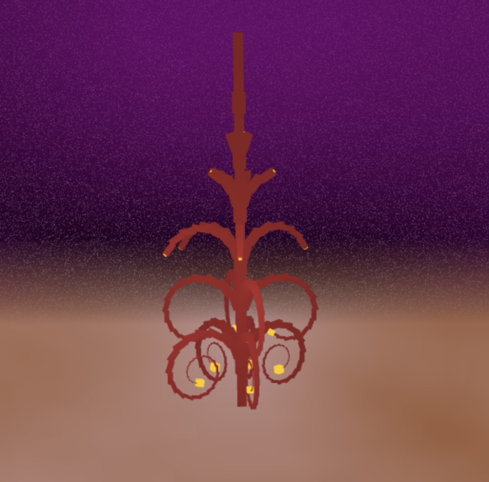
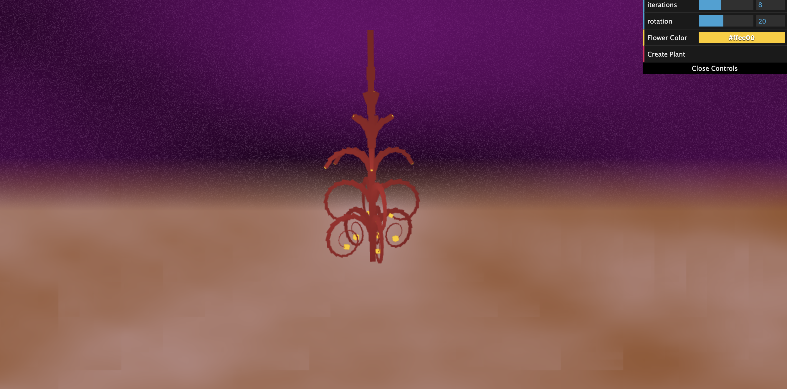
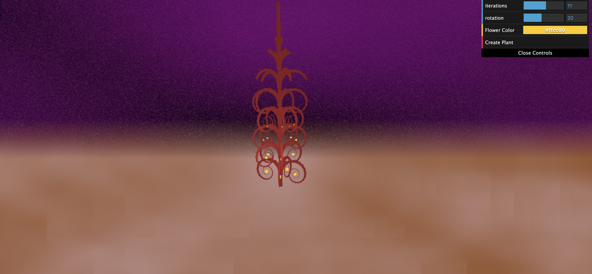
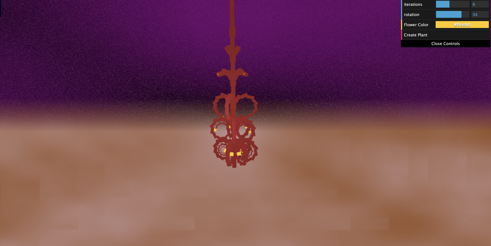
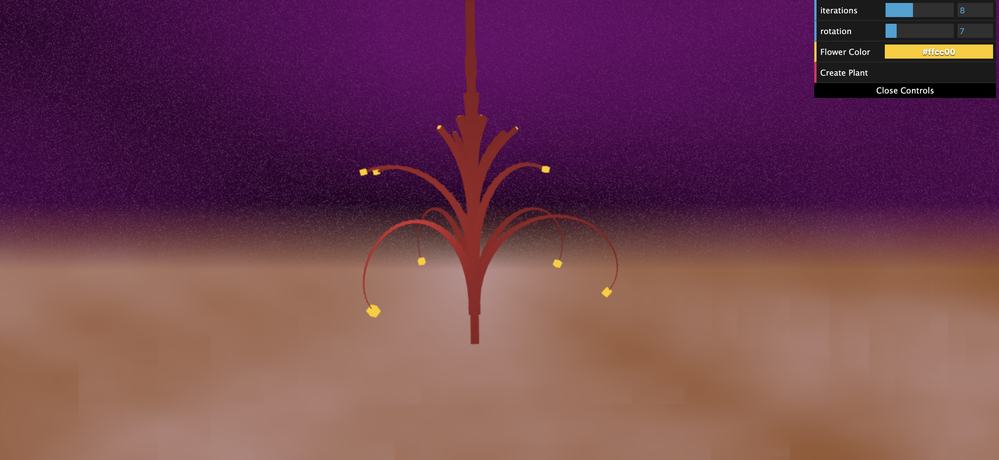
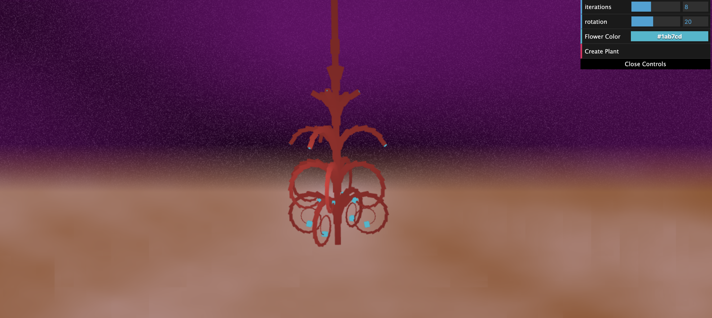

# L-Systems

Spring 2020  
Iciar Andreu Angulo  
PennKey: iciar

## Main Features
The L-System used to create this plant is:

X -> A  
A -> BTTA  
B1 -> T[&F*][&F*][&F*][&F*]  
B2 -> T[&F*][&F*][&F*][&F*][&F*]  
F -> F+F  

Where:
- **T and F** : move the turtle forward.
- **+** : rotates each section of the branches around the Z-axis.
- **&** : rotates the branch around the Y-axis.
- **\*** : represents the flowers.

- **B** : divides randomly between B1 and B2 (to change number of branches created each time).

## GUI Features

- **Iterations**: the number of iterations of the l-system the plant goes through.  
More Iterations (iterations = 11):

- **Rotation**: How much each branch rotates to create the circular shapes.  
With more rotation (rotation = 34):

With less rotation (rotation = 7):

- **Flower Color**: Change the color or the flowers (which are at the end of each branch).
Changed color to light blue:

## Resources
- https://workshop.chromeexperiments.com/examples/gui/#1--Basic-Usage
- http://iquilezles.org/www/articles/morenoise/morenoise.htm
- http://iquilezles.org/www/articles/gradientnoise/gradientnoise.htm
- https://thebookofshaders.com/12/
- https://www.redblobgames.com/maps/terrain-from-noise/
- http://web.mit.edu/cesium/Public/terrain.pdf
- http://iquilezles.org/www/articles/warp/warp.htm
